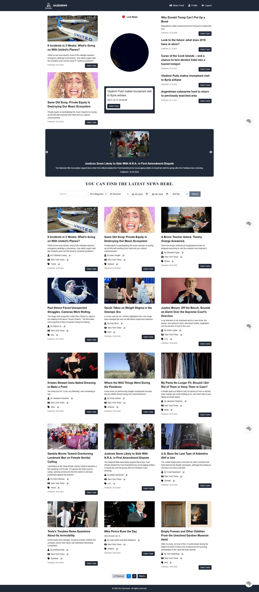
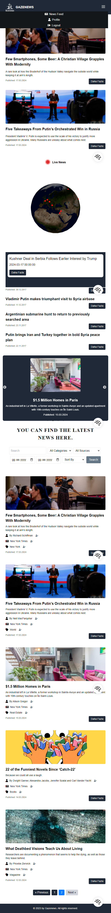
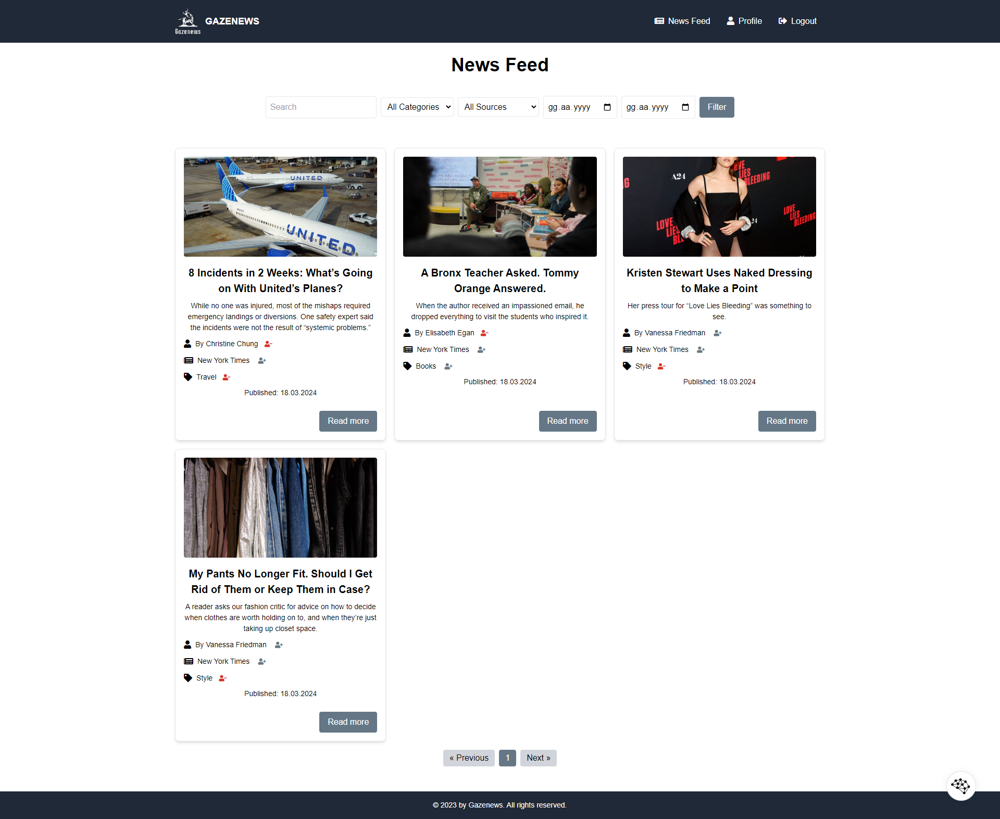
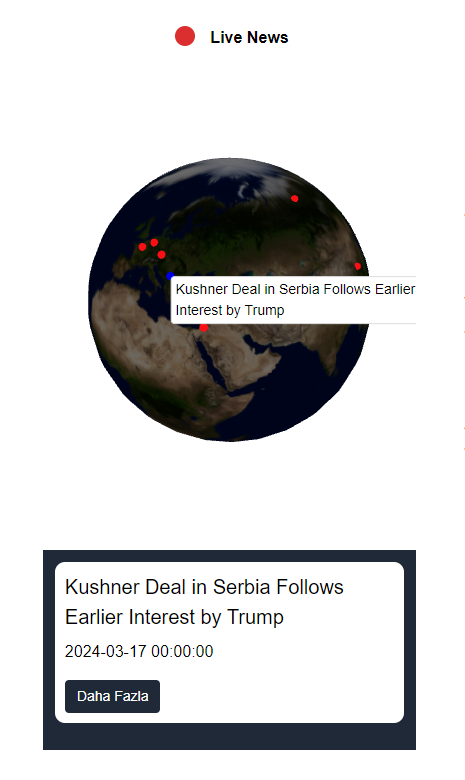

# Innoscripta-Task

## Documentation About My Project
Hello, I am Mert Yılmaz.

Below you will find detailed information about the project I created for this FullStack web development task.

--------------------------------------------

### Introduction
- This documentation provides a detailed description of the project I created for the FullStack web development task. The project employs a structure that includes Docker containers for a Flask application, a Laravel application, a React application, and a MySQL database.

### Overview
- Despite my busy 9-6 work schedule, I managed to complete the project, which comprises two main parts: Backend (Laravel) and Frontend (React.js). Laravel serves as the back-end service of the project, while the React application provides the user interface. The Flask application is used for extracting location data from news texts and performing geocoding.

### API Connections
- The project connects to three different APIs: NewsAPI, The Guardian, and BBC News. Data fetched from these APIs are saved to the database by a cron job that runs at specified intervals (every 12 hours).

### Database and Optimization
- A personalized news feed is provided to users based on the data retrieved from the database. To optimize the execution speed of PHP within the Docker environment, the vendor directory has been moved to srv, and xdebug has been deactivated to accelerate the debugging processes.

### Docker and Deployment
- Both projects were containerized using Docker, making them easily portable and reusable. The project can be effortlessly started with no extra configuration, simply by using the command docker-compose up --build. Migration processes are carried out automatically, eliminating the need for manual intervention.

### Design and Mobile Compatibility
The project's design sufficiently meets all the criteria for the project and is tailored to be displayed seamlessly and user-friendly on mobile devices.

### 3D Earth Map News
- This module enables users to interactively explore news events occurring around the world through a 3D Earth map developed using React and Three.js technologies. It presents dynamic points showing news headlines, locations, and relevant details. Clicking on a specific news point allows users to learn more about that news and access its detailed content, offering a unique news discovery experience by combining modern web technologies and geographic information systems.

Features
- Dynamic 3D Earth Map: An interactive 3D model displaying news locations around the globe.
News Points: Colored markers that allow users quick access to related news.
Detailed News Information: Clicking on a point reveals a pop-up with the news title, publication date, and a "Read More" link.
User Interaction: Users can follow or unfollow news points.
Optimized Performance: High-performance and smooth 3D experience thanks to Three.js and React-three/fiber libraries.
This module presents a new way to follow news, giving users the opportunity to explore global events. The interactive 3D Earth map not only increases interest in news but also serves as an educational and informative resource.

### AI-powered News Text Analysis and Location Identification Summary
- In this project, NLP (Natural Language Processing) and geocoding techniques are utilized to extract locations and other crucial information from news texts. The artificial intelligence integrated into the Flask application analyzes texts and converts locations into geographical coordinates for user presentation.

Key Features
- Text Analysis with NLP: Using spacy to identify elements such as locations, people, and institutions within news texts.
- Geocoding: Obtaining geographical coordinates of identified locations with geopy.
Automatic News Updates: Regular news updates through cron jobs.
Personalized Feed: Offering customized news recommendations based on user preferences.
- Artificial intelligence support optimizes news analysis and presentation, enriching and personalizing the user experience.

### Performance of Laravel in Docker
- The relatively slower performance of Laravel in Docker is primarily due to PHP's request model, combined with the latency in transferring data between Docker Desktop's Linux VM and the host MacOS machine. To maintain Docker's performance, it's crucial to minimize traversing between Docker Desktop's Linux VM and the host machine. This project has implemented the step of storing Composer's vendor/ directory inside the Docker container to ensure optimal performance.

### Data Filtering and User Interaction
- Users can click on a follow icon to follow an author, source, and category, which will be shown in the news feed. Similarly, clicking on an x icon allows users to unfollow an author, source, or category.

### Software Development Principles
During the development process, coding was done adhering to software development principles such as DRY (Don't Repeat Yourself), KISS (Keep It Simple, Stupid), and SOLID (Single responsibility, Open-closed, Liskov substitution, Interface segregation, Dependency inversion).
****
This documentation provides a general summary of my project. For further detailed information or any inquiries, please do not hesitate to contact me. Thank you for your attention.

## Full Website

## Mobile View

## News Feed

## 3D Earth Map News

## Filtering Data

## Click follow icon to follow a author, source and category this will be shown in the news feed

## Click x icon to unfollow a author, source and category this will be shown in the news feed

